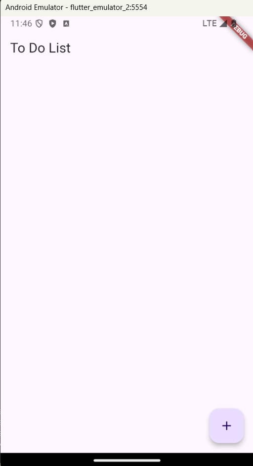
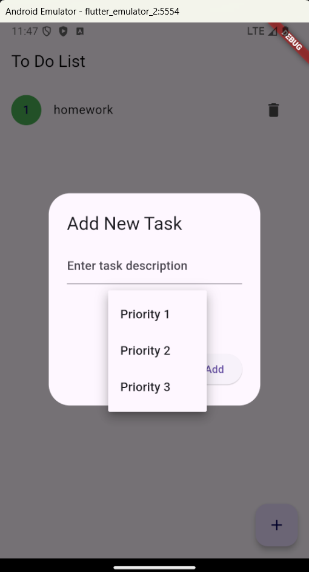
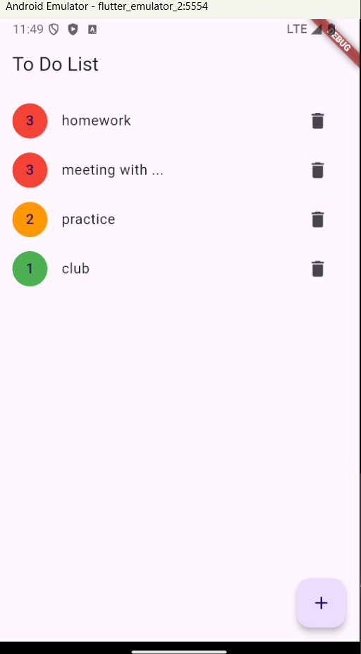

# Priority To-Do List App

## Audience

This app is designed for:
- Busy people managing multiple tasks and projects
- Students balancing assignments and extracurricular activities
- Anyone looking to organize their daily tasks and long-term goals efficiently

## What the App Does

The Priority To-Do List app allows users to:
- Create and manage tasks with customizable priority levels
- Organize tasks using an intuitive, priority-based sorting system
- Mark tasks as complete and easily remove finished items
- View tasks at a glance with a color-coded priority system

## Why It's Useful

Our app helps users:
- Prioritize tasks effectively, ensuring important items are never overlooked
- Increase productivity by focusing on high-priority tasks first
- Reduce stress by providing a clear, organized view of all pending tasks
- Achieve goals more efficiently through better task management

## Screenshots

The main interface with no tasks

What adding a task looks like

Example list of tasks with different priorities

